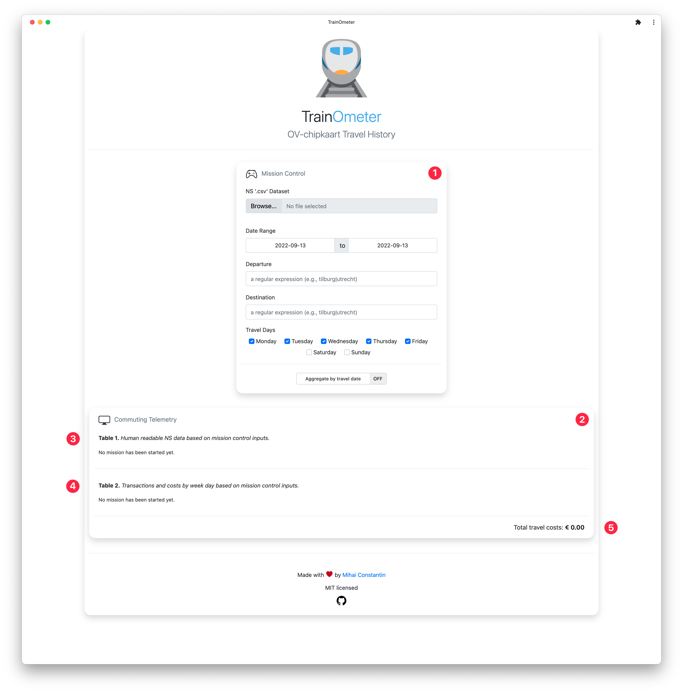
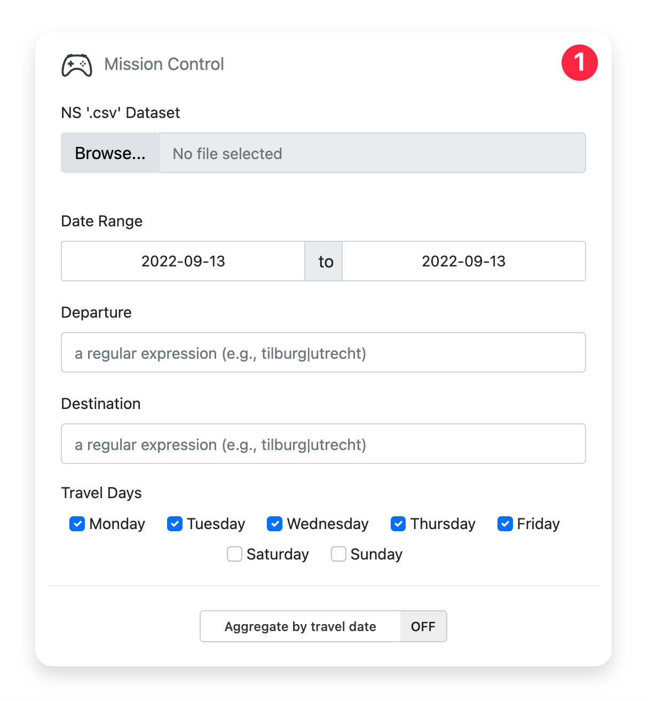
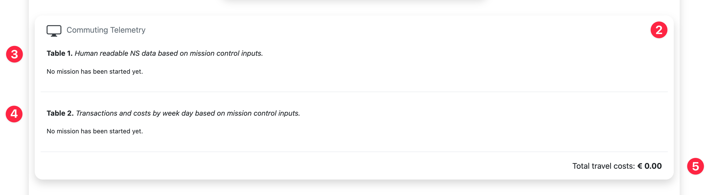
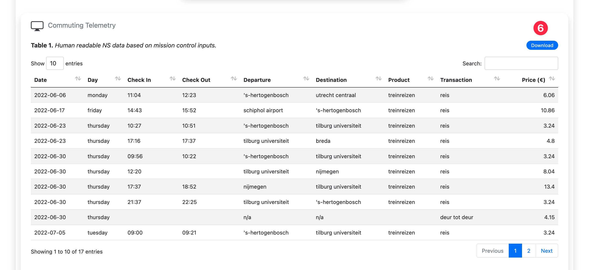
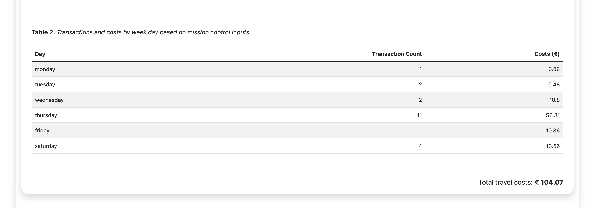
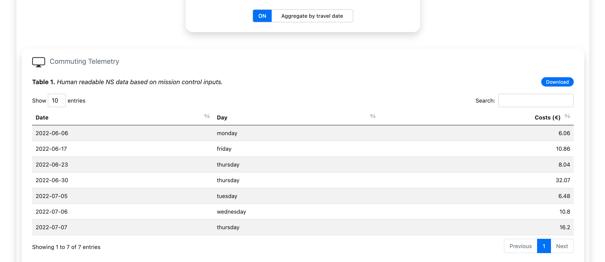

<div align="center">
    
</div>

<h1 align="center">TrainOmeter</h1>

<div align="center">
    
    
    
</div>

<br>

[**TrainOmeter**](https://mihaiconstantin.shinyapps.io/trainometer/) is a simple
[Shiny](https://shiny.rstudio.com) application designed to give you a quick
overview of your travel history based on the cryptic `.csv` data exported from
the [Mijn NS](https://www.ns.nl/mijnns) portal.

<br><hr>
<h3 align="center">
    Check out the application at <br>
    <a href="https://mihaiconstantin.shinyapps.io/trainometer/">mihaiconstantin.shinyapps.io/trainometer</a>
</h3>
<hr><br>

## Features

### Viewing and filtering NS data

[**TrainOmeter**](https://mihaiconstantin.shinyapps.io/trainometer/) allows you
to quickly process the NS data export and filter it based on various inputs.
Upon opening the application, you are presented with the following screen (i.e.,
see image below):

<div align="center">
    <h4>Application Structure</h4>
    
</div>

The application consists of two main panels, the _Mission Control_ and
_Commuting Telemetry_ panels, which are indicated with numbers one and two in
the image above. The *Commuting Telemetry* panel is further divided into three
sections (i.e., see below).

#### Mission Control

The _Mission Control_ panel (i.e., as seen in the image below) contains all the
inputs necessary to upload the data, process it, and filter it accordingly. For
example, using the form inputs in this panel, you can filter the data based on
travel dates and travel days. Moreover, you can filter the data based on the
 departure and destination station using [Regular
Expressions](https://www.regular-expressions.info/reference.html)(i.e., `regex`)
based on the [`PCRE` flavor](https://www.regular-expressions.info/pcre.html).
Finally, this panel also provides an oddly positioned switch to *aggregate* the
data by *travel date*.

<div align="center">
    <h4>Mission Control Panel</h4>
    
</div>

#### Commuting Telemetry

The *Commuting Telemetry* panel (i.e., see the image below) displays the
processed NS data, while taking into account the filters specified in the
*Mission Control* panel. This panel is divided into three sections:

- ***Table 1*** (i.e., indicated by number three) displays the processed NS data
  or the aggregated variant (i.e., when the aggregation switch is active). In
  either case, the data displayed is based on the filters selected above.

- ***Table 2*** (i.e., indicated by number four) displays the number of
  transactions (e.g., train travels) and travel costs for each day selected in
  the *Mission Control* panel.

- Finally, the section indicated with number five displays the *total travel
  costs* based on the current selection of filters.

<div align="center">
    <h4>Commuting Telemetry Panel</h4>
    
</div>

The next two images below provide an example of what **_Table 1_** and **_2_**
look like when they are filled with data. Once the data is loaded, a _download
button_ is also available on the top-right side of the panel (i.e., indicated by
number six in the image below).

<div align="center">
    <h4>Table 1. Processed NS data</h4>
    
</div>

<br>

<div align="center">
    <h4>Table 2. Transactions and travels costs by day</h4>
    
</div>

### Aggregating

The aggregation switch in the *Mission Control* enables you to aggregate by
travel date. When this switch is on, **_Table 1_** will display the aggregated
data instead of the complete processed NS one (i.e., see the image below for an
example).

<div align="center">
    <h4>Table 1. Aggregated data by date</h4>
    
</div>

Aggregating by travel date, and fixing the departure and destination station, can be
handy when you want to report your travel history for reimbursing the commute
expenses.

### Exporting

The download button in the *Commuting Telemetry* panel allows you to export the
data in **_Table 1_** in `.csv` format easily. The export considers the
filterers used in the *Mission Control* panel, including whether the aggregation
switch is on or not.

## Installation

Aside from accessing the application at
[mihaiconstantin.shinyapps.io/trainometer](https://mihaiconstantin.shinyapps.io/trainometer/),
you can also download and run it locally. To do so, you need to perform a series
of steps.

First, download the repository, e.g.:

```bash
# Clone the repository.
git clone https://github.com/mihaiconstantin/trainometer.git

# Enter the repository.
cd trainometer
```

Start an `R` session, or open the folder in RStudio, then run the following:

```r
# Load shiny.
library(shiny)

# Run app.
runApp(".")
```

Note that the application also depends on the `DT` and `shinyWidgets` packages.
You may also need to install these two packages, e.g.:

```r
install.packages(c("DT", "shinyWidgets"))
```

## Development

Should the NS change the data export format in the future, the data
pre-processing logic is encapsulated in the `load_ns_data` function, i.e.:

https://github.com/mihaiconstantin/trainometer/blob/58908f5a49bf712b41eafcd9a997e704c62e0210/global.R#L77-L137

Ensuring that `load_ns_data` returns a data frame that contains the following
columns will keep the application running:

- `date` - The date of the travel.
- `day` - The day of the travel.
- `check_in` - The check in time.
- `check_out` - The check out time.
- `departure` - The departure station.
- `destination` - The destination station.
- `product` - The type of product (e.g., train, bus etc.).
- `transaction` - The transaction type (e.g., reis, deur tot deur etc.).
- `price` - The costs associated with the product.

## Release Notes

See the [CHANGELOG](CHANGELOG.md) file.

## Contributing

Any contributions, suggestions, or bug reports are welcome and greatly
appreciated.

## License

[`TrainOmeter`](https://mihaiconstantin.shinyapps.io/trainometer/) is licensed
under the [MIT license](LICENSE).

<p xmlns:cc="http://creativecommons.org/ns#" xmlns:dct="http://purl.org/dc/terms/">
    <a property="dct:title" rel="cc:attributionURL" href="https://github.com/mihaiconstantin/trainometer/tree/main/www/images/icons">
        Icons and logo
    </a>
    by
    <a rel="cc:attributionURL dct:creator" property="cc:attributionName" href="https://twemoji.twitter.com">
        twemoji project
    </a>
    licensed under
    <a href="http://creativecommons.org/licenses/by/4.0/?ref=chooser-v1" target="_blank" rel="license noopener noreferrer" style="display:inline-block;">CC BY 4.0</a>.
</p>
